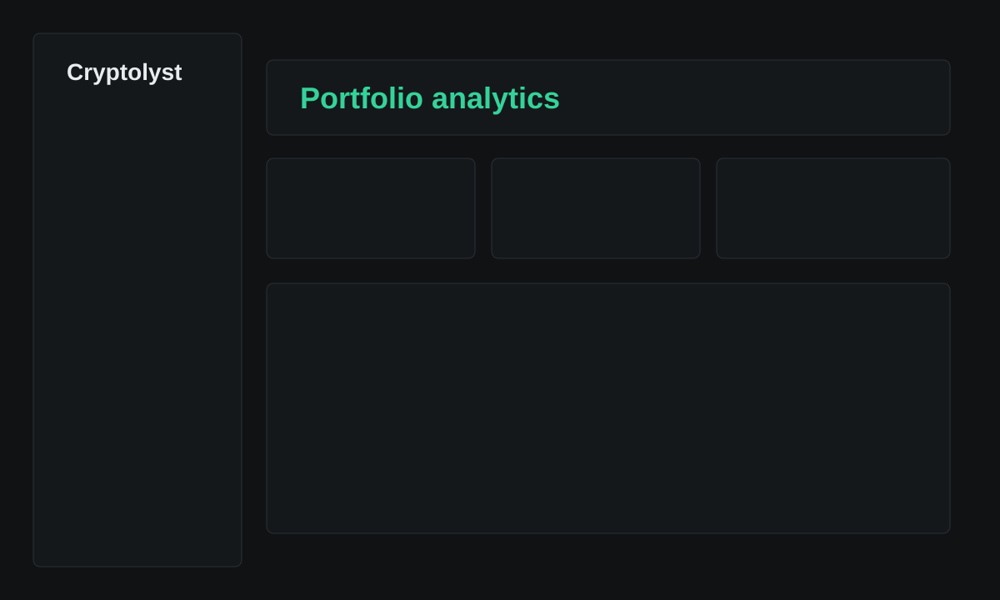

# Cryptolyst

[](https://github.com/ezn24/cryptolyst/actions/workflows/docker-publish.yml)
[](https://hub.docker.com/r/1030283726/cryptolyst)

Cryptolyst is a self-hosted cryptocurrency trade journal and portfolio analytics application. It keeps each asset and buy lot separate, calculates realized and unrealized profit with decimal arithmetic, tracks partial sales and profit targets, and refreshes market prices automatically.



## Features

- Asset-grouped investment ledgers with independent charts
- Buy lots, unlimited partial sales, fees, exchanges, accounts, and notes
- Remaining cost, average entry, break-even status, realized and unrealized P&L
- Per-lot profit targets and target-price tracking
- CoinGecko and Binance public price providers
- Configurable background price refresh interval
- Per-asset colors and coin icons
- Light, dark, and system themes
- CSV transaction import and export
- Full JSON backup export and restore into a new database
- Legacy spreadsheet migration utility
- Single-user password authentication with bcrypt
- SQLite persistence with no external database service required

## Quick Start with Docker Compose

### 1. Clone the repository

```bash
git clone https://github.com/ezn24/cryptolyst.git
cd cryptolyst
```

### 2. Create the environment file

```bash
cp .env.example .env
```

Generate a bcrypt password hash:

```bash
npm install
npm run hash-password -- "choose-a-strong-password"
```

Copy the printed **Docker Compose `.env`** value to `APP_PASSWORD_HASH`, then generate a session secret:

```bash
openssl rand -hex 32
```

Your `.env` should contain at least:

```env
APP_PASSWORD_HASH=$$2b$$12$$...
SESSION_SECRET=replace-with-at-least-32-random-characters
```

### 3. Start Cryptolyst

```bash
docker compose up -d
```

Open [http://localhost:3000](http://localhost:3000).

The Compose project uses the `cryptolyst-data` named volume for the SQLite database. Container recreation and image updates do not remove this volume.

## Updating

```bash
docker compose pull
docker compose up -d --force-recreate
```

To pin a specific image version, set `CRYPTOLYST_IMAGE` in `.env`:

```env
CRYPTOLYST_IMAGE=1030283726/cryptolyst:sha-6224090
```

## Docker CLI

```bash
docker volume create cryptolyst-data

docker run -d \
  --name cryptolyst \
  --restart unless-stopped \
  -p 3000:3000 \
  -e DATABASE_URL=file:/data/cryptolyst.db \
  -e APP_PASSWORD_HASH='\$2b\$12\$...' \
  -e SESSION_SECRET='replace-with-at-least-32-random-characters' \
  -v cryptolyst-data:/data \
  1030283726/cryptolyst:latest
```

## Build from Source

```bash
docker build -t cryptolyst:local .
```

Run the locally built image:

```bash
docker run -d \
  --name cryptolyst \
  -p 3000:3000 \
  -e DATABASE_URL=file:/data/cryptolyst.db \
  -e APP_PASSWORD_HASH='\$2b\$12\$...' \
  -e SESSION_SECRET='replace-with-at-least-32-random-characters' \
  -v cryptolyst-data:/data \
  cryptolyst:local
```

## Configuration

| Variable | Default | Description |
| --- | --- | --- |
| `DATABASE_URL` | `file:/data/cryptolyst.db` | Prisma SQLite URL inside the container |
| `APP_PASSWORD_HASH` | Required | bcrypt `$2a$`, `$2b$`, or `$2y$` password hash |
| `SESSION_SECRET` | Required | Random session-signing secret of at least 32 characters |
| `PRICE_PROVIDER` | `coingecko` | Default market price provider |
| `PRICE_REFRESH_INTERVAL_MINUTES` | `5` | Background price refresh interval |
| `TZ` | `UTC` | Container timezone |
| `TRUST_PROXY` | `true` | Enables operation behind a trusted reverse proxy |
| `PORT` | `3000` | Host port used by `compose.yml` |
| `CRYPTOLYST_IMAGE` | `1030283726/cryptolyst:latest` | Image used by `compose.yml` |

The application settings page can change the price provider, refresh interval, timezone, theme, decimal precision, and other display preferences.

## Local Development

Requirements: Node.js 24 and npm.

```bash
npm install
cp .env.example .env
npm run db:generate
npm run db:init
npm run seed
npm run dev
```

Open [http://localhost:3000](http://localhost:3000).

Useful commands:

```bash
npm run lint
npm run typecheck
npm test
npm run build
```

## Data and Backups

Cryptolyst stores application data in SQLite. The Docker image uses `/data/cryptolyst.db`, persisted by the `cryptolyst-data` named volume.

The recommended portable backup workflow is available in **Import / Export**:

1. Download a complete JSON backup.
2. Store the file outside the container.
3. Import it into a new, empty Cryptolyst database when restoration is required.

JSON backups contain assets, buy lots, sales, profit targets, price history, and application settings. JSON restore refuses to write into a database that already contains portfolio data.

## CSV Import and Export

CSV imports support `BUY` and `SELL` rows. Required columns are:

```text
type,asset,date,price,quantity
```

Optional columns include:

```text
fee,feeCurrency,exchange,account,note,buyLotReference
```

`SELL` rows must provide the target buy-lot ID in `buyLotReference`.

## Legacy Spreadsheet Import

Preview an existing workbook without changing the database:

```bash
npm run import:legacy -- "/path/to/crypto-trades.xlsx"
```

Commit the validated import:

```bash
npx tsx scripts/import-legacy-xlsx.ts "/path/to/crypto-trades.xlsx" --commit
```

Use `--replace-existing` only when intentionally rebuilding the database from the workbook.

## Price Updates

The server starts its price scheduler automatically. It performs the first update shortly after startup and then uses the configured refresh interval. Failed provider requests retain the last valid price.

- CoinGecko uses each asset's CoinGecko ID.
- Binance uses each asset's Binance symbol.
- Manual prices remain available from the price-management page.

To populate missing CoinGecko icons:

```bash
npm run sync-icons
```

## Architecture

- Next.js App Router and React Server Components
- TypeScript and Server Actions
- Tailwind CSS, Lucide Icons, and Recharts
- Prisma ORM with SQLite
- `decimal.js` for financial calculations
- bcrypt password verification and signed HttpOnly sessions

## Continuous Delivery

The GitHub Actions workflow validates every relevant source change with type checking, linting, and tests, then publishes the Docker image to Docker Hub.

Published tags include:

- `latest` for the default branch
- `sha-<commit>` for each build
- Semantic-version tags for Git tags such as `v1.2.0`

## Security

- Keep `.env` outside version control.
- Use a unique password and a randomly generated session secret.
- Cryptolyst does not require exchange API keys or private keys.
- All mutations require an authenticated session.
- Financial calculations run on the server using decimal arithmetic.

## License

This project is licensed under the GNU General Public License v3.0 (GPL-3.0). See LICENSE.
